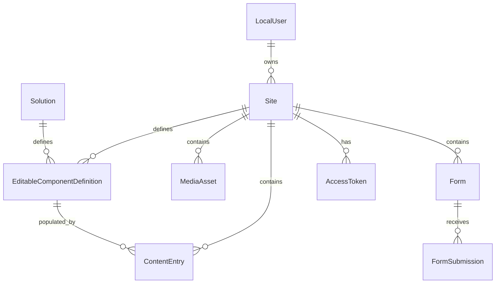
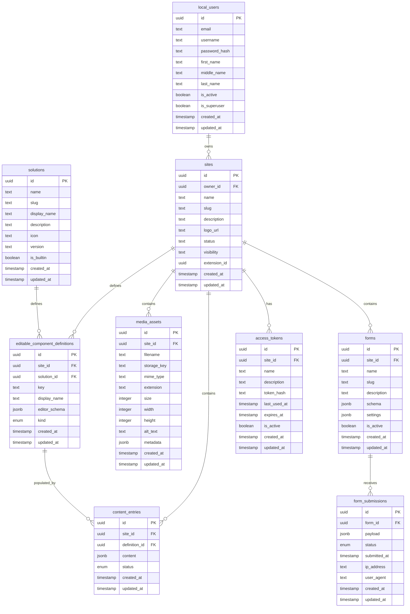

# Keel Domain Model

This document describes the entire Keel database domain model. It is intended to be a single source of truth for developers, AI agents, and dashboard authors who need to understand how entities relate to each other.

## Table of Contents

- [Architecture Overview](#architecture-overview)
- [Shared Infrastructure](#shared-infrastructure)
  - [Base Mixins](#base-mixins)
  - [Shared Enumerations](#shared-enumerations)
- [Domains](#domains)
  - [Identity](#identity)
  - [Site Management](#site-management)
  - [Content Engine](#content-engine)
  - [Media](#media)
  - [Forms](#forms)
  - [Integration](#integration)
- [Relationship Map](#relationship-map)
- [Entity-Relationship Diagram](#entity-relationship-diagram)
- [Usage Examples](#usage-examples)
- [Conventions & Notes](#conventions--notes)

---

## Architecture Overview

The domain model is organized into six bounded contexts under `keelhq/db/models`:

```text
keelhq/db/models/
├── identity/                 # LocalUser
├── site_management/          # Site, Solution
├── content_engine/           # EditableComponentDefinition, ContentEntry
├── media/                    # MediaAsset
├── forms/                    # Form, FormSubmission
└── integration/              # AccessToken
```

Every table model inherits from `BaseModel` (`UUIDMixin` + `TimestampMixin`) and therefore includes:

- `id` (`UUID`, primary key, default `uuid4()`)
- `created_at` (`datetime`, UTC, auto-set on insert)
- `updated_at` (`datetime`, UTC, nullable)

Cross-domain references are defined via explicit SQLModel `Relationship` fields and use `TYPE_CHECKING` imports to avoid circular dependencies. This keeps the domain layer decoupled while still allowing SQLAlchemy to resolve mappers when the full model graph is loaded through `keelhq.db.base`.

---

## Shared Infrastructure

### Base Mixins

Located in `keelhq/db/models/mixins.py`.

| Mixin | Responsibility | Fields Added |
|-------|---------------|--------------|
| `UUIDMixin` | Provides a UUID primary key. | `id: UUID` |
| `TimestampMixin` | Provides audit timestamps. | `created_at: datetime`, `updated_at: Optional[datetime]` |
| `IsPartOfSite` | Adds a foreign key to `sites`. | `site_id: UUID` (FK `sites.id`, indexed) |
| `IsPartOfSolution` | Adds a foreign key to `solutions`. | `solution_id: UUID` (FK `solutions.id`, indexed) |
| `BaseModel` | Combines `UUIDMixin` + `TimestampMixin`. | All of the above |

### Shared Enumerations

Located in `keelhq/shared/enums.py`.

#### `EditableComponentKind`

Controls whether a component expects a single entry or a collection.

| Value | Meaning | Examples |
|-------|---------|----------|
| `SINGLETON` | Exactly one entry. | Hero, Footer, About, SEO |
| `COLLECTION` | Zero or more entries. | Projects, Products, Services, Testimonials, FAQ |

#### `ContentStatus`

Publication state of a `ContentEntry`.

| Value | Meaning |
|-------|---------|
| `DRAFT` | Being edited, not public. |
| `PUBLISHED` | Approved and public. |
| `ARCHIVED` | No longer public, retained for history. |

#### `FormSubmissionStatus`

Review state of a `FormSubmission`.

| Value | Meaning |
|-------|---------|
| `PENDING` | Received but not reviewed. |
| `PROCESSED` | Reviewed and handled. |
| `SPAM` | Flagged as unsolicited. |

---

## Domains

### Identity

#### `LocalUser`

**Module:** `keelhq/db/models/identity/local_user.py`  
**Table:** `local_users`

Development-only local authentication account. A user can own many sites.

| Column | Type | Constraints | Notes |
|--------|------|-------------|-------|
| `id` | `UUID` | PK | From `BaseModel` |
| `email` | `str` | Unique, indexed | Sign-in identifier |
| `username` | `str` | Unique, indexed | Public identifier |
| `password_hash` | `str` | Not null | Never store plain text |
| `first_name` | `str` | Not null | |
| `middle_name` | `str` | Optional | |
| `last_name` | `str` | Optional | |
| `is_active` | `bool` | Default `True` | |
| `is_superuser` | `bool` | Default `False` | |
| `created_at` | `datetime` | Not null | From `BaseModel` |
| `updated_at` | `datetime` | Optional | From `BaseModel` |

**Relationships:**

- `sites` → `Site` (1:N) via `Site.owner_id`

---

### Site Management

#### `Site`

**Module:** `keelhq/db/models/site_management/site.py`  
**Table:** `sites`

A site is the central tenant of Keel. Almost every other entity belongs to a site.

| Column | Type | Constraints | Notes |
|--------|------|-------------|-------|
| `id` | `UUID` | PK | From `BaseModel` |
| `owner_id` | `UUID` | FK `local_users.id`, indexed | The user who owns the site |
| `name` | `str` | Not null | Display name |
| `slug` | `str` | Unique, not null | URL-safe identifier |
| `description` | `str` | Optional, max 250 | |
| `logo_url` | `str` | Optional | |
| `status` | `str` | Not null | e.g., `active`, `inactive` |
| `visibility` | `str` | Not null | e.g., `public`, `private` |
| `extension_id` | `UUID` | Optional | Links to extension/site template |
| `created_at` | `datetime` | Not null | From `BaseModel` |
| `updated_at` | `datetime` | Optional | From `BaseModel` |

**Relationships:**

- `owner` → `LocalUser` (N:1) via `owner_id`
- `definitions` → `EditableComponentDefinition` (1:N)
- `content_entries` → `ContentEntry` (1:N)
- `media_assets` → `MediaAsset` (1:N)
- `forms` → `Form` (1:N)
- `access_tokens` → `AccessToken` (1:N)

#### `Solution`

**Module:** `keelhq/db/models/site_management/solution.py`  
**Table:** `solutions`

A reusable website template that defines which editable sections should exist. It is content-agnostic; actual values live in `ContentEntry`.

| Column | Type | Constraints | Notes |
|--------|------|-------------|-------|
| `id` | `UUID` | PK | From `BaseModel` |
| `name` | `str` | Indexed, not null | Internal name |
| `slug` | `str` | Unique, not null | URL-safe identifier |
| `display_name` | `str` | Not null | Dashboard label |
| `description` | `str` | Optional | |
| `icon` | `str` | Optional | Dashboard icon identifier |
| `version` | `str` | Default `0.1.0`, not null | Template version |
| `is_builtin` | `bool` | Default `True` | Keel-built vs. user/AI-created |
| `created_at` | `datetime` | Not null | From `BaseModel` |
| `updated_at` | `datetime` | Optional | From `BaseModel` |

**Relationships:**

- `definitions` → `EditableComponentDefinition` (1:N)

---

### Content Engine

#### `EditableComponentDefinition`

**Module:** `keelhq/db/models/content_engine/editable_component_definition.py`  
**Table:** `editable_component_definitions`

Defines a template for an editable section of a site. It tells the dashboard what fields exist and how to render the editor.

| Column | Type | Constraints | Notes |
|--------|------|-------------|-------|
| `id` | `UUID` | PK | From `BaseModel` |
| `site_id` | `UUID` | FK `sites.id`, indexed | From `IsPartOfSite` |
| `solution_id` | `UUID` | FK `solutions.id`, indexed | From `IsPartOfSolution` |
| `key` | `str` | Indexed, not null | Stable identifier for the section |
| `display_name` | `str` | Not null | Human-readable label |
| `editor_schema` | `JSONB` | Default `[]`, not null | Field definitions for the dashboard |
| `kind` | `EditableComponentKind` | Not null | `singleton` or `collection` |
| `created_at` | `datetime` | Not null | From `BaseModel` |
| `updated_at` | `datetime` | Optional | From `BaseModel` |

**Relationships:**

- `site` → `Site` (N:1)
- `solution` → `Solution` (N:1)
- `entries` → `ContentEntry` (1:N)

#### `ContentEntry`

**Module:** `keelhq/db/models/content_engine/content_entry.py`  
**Table:** `content_entries`

Stores the actual user-generated content for an editable component.

| Column | Type | Constraints | Notes |
|--------|------|-------------|-------|
| `id` | `UUID` | PK | From `BaseModel` |
| `site_id` | `UUID` | FK `sites.id`, indexed | From `IsPartOfSite` |
| `definition_id` | `UUID` | FK `editable_component_definitions.id`, indexed | The template this entry belongs to |
| `content` | `JSONB` | Default `{}`, not null | Actual field values |
| `status` | `ContentStatus` | Not null | `draft`, `published`, `archived` |
| `created_at` | `datetime` | Not null | From `BaseModel` |
| `updated_at` | `datetime` | Optional | From `BaseModel` |

**Relationships:**

- `site` → `Site` (N:1)
- `definition` → `EditableComponentDefinition` (N:1)

---

### Media

#### `MediaAsset`

**Module:** `keelhq/db/models/media/media_asset.py`  
**Table:** `media_assets`

Metadata for an uploaded file. The bytes live in an external storage provider (S3, R2, etc.).

| Column | Type | Constraints | Notes |
|--------|------|-------------|-------|
| `id` | `UUID` | PK | From `BaseModel` |
| `site_id` | `UUID` | FK `sites.id`, indexed | From `IsPartOfSite` |
| `filename` | `str` | Not null | Original display name |
| `storage_key` | `str` | Unique, indexed, not null | Provider-specific key |
| `mime_type` | `str` | Optional | e.g., `image/jpeg` |
| `extension` | `str` | Optional | Without leading dot |
| `size` | `int` | Not null | Bytes |
| `width` | `int` | Optional | Pixels for visual assets |
| `height` | `int` | Optional | Pixels for visual assets |
| `alt_text` | `str` | Optional | Accessibility description |
| `metadata` | `JSONB` | Default `{}`, not null | Provider/dashboard metadata |
| `created_at` | `datetime` | Not null | From `BaseModel` |
| `updated_at` | `datetime` | Optional | From `BaseModel` |

**Python attribute note:** The column is named `metadata`, but the Python attribute is `extra_metadata` because `metadata` shadows a SQLAlchemy reserved attribute on the declarative base.

**Relationships:**

- `site` → `Site` (N:1)

**Constraints:**

- Unique constraint on `storage_key`
- Index on `site_id`

---

### Forms

#### `Form`

**Module:** `keelhq/db/models/forms/form.py`  
**Table:** `forms`

An editable form on a site. The field definitions are stored in the `schema` column and the submitted values in `FormSubmission.payload`.

| Column | Type | Constraints | Notes |
|--------|------|-------------|-------|
| `id` | `UUID` | PK | From `BaseModel` |
| `site_id` | `UUID` | FK `sites.id`, indexed | From `IsPartOfSite` |
| `name` | `str` | Not null | Dashboard label |
| `slug` | `str` | Indexed, not null | URL-safe identifier per site |
| `description` | `str` | Optional | |
| `schema` | `JSONB` | Default `[]`, not null | Field definitions for the editor |
| `settings` | `JSONB` | Default `{}`, not null | Notifications, redirects, CAPTCHA, etc. |
| `is_active` | `bool` | Default `True`, not null | Accepting submissions? |
| `created_at` | `datetime` | Not null | From `BaseModel` |
| `updated_at` | `datetime` | Optional | From `BaseModel` |

**Python attribute note:** The column is named `schema`, but the Python attribute is `field_schema` because `schema` shadows a SQLAlchemy reserved attribute on the base class.

**Relationships:**

- `site` → `Site` (N:1)
- `submissions` → `FormSubmission` (1:N)

**Constraints:**

- Unique constraint on (`site_id`, `slug`)
- Indexes on `site_id` and `slug`

#### `FormSubmission`

**Module:** `keelhq/db/models/forms/form_submission.py`  
**Table:** `form_submissions`

A single visitor submission for a form.

| Column | Type | Constraints | Notes |
|--------|------|-------------|-------|
| `id` | `UUID` | PK | From `BaseModel` |
| `form_id` | `UUID` | FK `forms.id`, indexed | Parent form |
| `payload` | `JSONB` | Default `{}`, not null | Submitted values |
| `status` | `FormSubmissionStatus` | Indexed, default `PENDING` | `pending`, `processed`, `spam` |
| `submitted_at` | `datetime` | Not null | Visitor submission time |
| `ip_address` | `str` | Optional | |
| `user_agent` | `str` | Optional | |
| `created_at` | `datetime` | Not null | From `BaseModel` |
| `updated_at` | `datetime` | Optional | From `BaseModel` |

**Relationships:**

- `form` → `Form` (N:1)

**Constraints:**

- Indexes on `form_id`, `status`, `submitted_at`

---

### Integration

#### `AccessToken`

**Module:** `keelhq/db/models/integration/access_token.py`  
**Table:** `access_tokens`

A secure API/MCP access token scoped to a site. Only the hash is stored; the raw token is never persisted.

| Column | Type | Constraints | Notes |
|--------|------|-------------|-------|
| `id` | `UUID` | PK | From `BaseModel` |
| `site_id` | `UUID` | FK `sites.id`, indexed | From `IsPartOfSite` |
| `name` | `str` | Not null | Label, e.g., `Claude Code` |
| `description` | `str` | Optional | |
| `token_hash` | `str` | Unique, indexed, not null | Hash of the raw token |
| `last_used_at` | `datetime` | Optional | Audit field |
| `expires_at` | `datetime` | Optional | Expiration time |
| `is_active` | `bool` | Default `True`, not null | |
| `created_at` | `datetime` | Not null | From `BaseModel` |
| `updated_at` | `datetime` | Optional | From `BaseModel` |

**Relationships:**

- `site` → `Site` (N:1)

**Constraints:**

- Unique constraint on `token_hash`
- Index on `site_id`

---

## Relationship Map

A high-level conceptual view of the domain model. See the diagram files for a visual version:

- `relationship-diagram.viz` (Graphviz)
- `relationship.mermaid` (Mermaid)

```text
LocalUser ||--o{ Site : owns
Site ||--o{ EditableComponentDefinition : defines
Site ||--o{ ContentEntry : contains
Site ||--o{ MediaAsset : contains
Site ||--o{ Form : contains
Site ||--o{ AccessToken : has
Solution ||--o{ EditableComponentDefinition : defines
EditableComponentDefinition ||--o{ ContentEntry : populated_by
```

---

## Entity-Relationship Diagram

A physical view of the tables, columns, and foreign keys. See the diagram files for a visual version:

- `erd.viz` (Graphviz)
- `erd.mermaid` (Mermaid)

---

## Usage Examples

### Creating a site and its owner

```python
from sqlmodel import Session
from keelhq.db.models import LocalUser, Site

owner = LocalUser(
    email="alice@example.com",
    username="alice",
    password_hash="...",
    first_name="Alice",
    last_name="Smith",
)
site = Site(
    owner=owner,
    name="Alice's Portfolio",
    slug="alice-portfolio",
    status="active",
    visibility="public",
)

with Session(engine) as session:
    session.add(owner)
    session.add(site)
    session.commit()
```

### Adding a content entry

```python
from keelhq.db.models import EditableComponentDefinition, ContentEntry
from keelhq.shared.enums import ContentStatus

hero = EditableComponentDefinition(
    site=site,
    key="hero",
    display_name="Hero Section",
    editor_schema=[{"field": "headline", "type": "text"}],
    kind="singleton",
)
entry = ContentEntry(
    site=site,
    definition=hero,
    content={"headline": "Hello, world!"},
    status=ContentStatus.PUBLISHED,
)
```

### Collecting a form submission

```python
from keelhq.db.models import Form, FormSubmission
from keelhq.shared.enums import FormSubmissionStatus

contact_form = Form(
    site=site,
    name="Contact",
    slug="contact",
    field_schema=[{"field": "email", "type": "email"}],
)
submission = FormSubmission(
    form=contact_form,
    payload={"email": "visitor@example.com"},
    status=FormSubmissionStatus.PENDING,
)
```

### Querying media for a site

```python
from sqlmodel import select
from keelhq.db.models import MediaAsset

statement = select(MediaAsset).where(MediaAsset.site_id == site.id)
assets = session.exec(statement).all()
```

---

## Conventions & Notes

1. **Primary keys:** Every table uses a UUID primary key generated by `uuid4()`. Avoid exposing sequential integers to the frontend or URLs.
2. **Timestamps:** `created_at` and `updated_at` come from `TimestampMixin`. `updated_at` is not automatically refreshed by the mixin; set it explicitly in update paths or use an SQLAlchemy event.
3. **Cross-domain imports:** Use `TYPE_CHECKING` for type hints and absolute imports across domains to avoid circular imports. Runtime references in `Relationship` are string annotations and are resolved by SQLAlchemy when `keelhq.db.base` is loaded.
4. **JSONB columns:** `editor_schema`, `content`, `schema`, `settings`, `payload`, `metadata`, and other flexible data use PostgreSQL `JSONB`. Treat them as validated at the application layer, not the database layer.
5. **Reserved attribute names:**
   - `Form.schema` is exposed as the Python attribute `field_schema` because `schema` is reserved by SQLAlchemy/SQLModel. The column remains `schema`.
   - `MediaAsset.metadata` is exposed as the Python attribute `extra_metadata` because `metadata` is reserved by SQLAlchemy. The column remains `metadata`.
6. **No raw secrets:** `AccessToken` stores only `token_hash`. Generate the raw token once, return it to the caller, and never persist it.
7. **Soft deletion:** Deletion is not always implemented as a separate `is_deleted` flag. Check each model's active flags (e.g., `ContentStatus.ARCHIVED`, `is_active`, `FormSubmissionStatus`) for domain-specific soft-delete behavior.
8. **Indexes:** FK columns, status fields, slugs, and commonly filtered columns are indexed. Unique constraints are explicit and named.
9. **Single source of metadata:** `keelhq.db.base` imports every model so that SQLModel's `metadata` is complete for Alembic. When adding a new model, import it there and update `keelhq.db.models.__init__`.

## Relationship Diagram


## ERD

The Mermaid ERD below highlights **primary keys** and **foreign keys** only. Detailed indexes, unique constraints, and nullable rules are documented in the per-model tables above.

